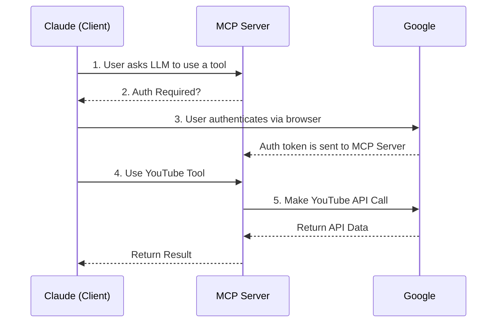

# YouTube MCP Server

An OAuth-enabled Model Context Protocol (MCP) server that provides a powerful suite of tools for searching, analyzing, and managing YouTube content through Claude.ai. This server uses the official YouTube Data API v3.

## 🌟 Features

- **Simple Authentication**: Easy-to-use OAuth 2.0 flow for secure access.
- **Official YouTube API**: Uses YouTube Data API v3 for all operations.
- **In-Memory Session**: Lightweight, database-free design for easy deployment.
- **Versatile Toolkit**: Provides tools for video search, metadata analysis, comment retrieval, and channel management.
- **Graceful Error Handling**: User-friendly error messages.
- **Self-Contained**: Runs as a single binary with minimal dependencies.

## 🏗️ Architecture



## 🚀 Quick Start

### Prerequisites

- Go 1.21 or higher
- Google Cloud Project with YouTube Data API v3 enabled
- Google OAuth 2.0 credentials

### 1. Google Cloud Setup

To ensure end-users can easily set up their own instance of the server, we need to provide a clear, step-by-step guide on how to obtain their own Google OAuth credentials.

**Instructions for the User:**

1.  **Go to the Google Cloud Console**: Visit [https://console.cloud.google.com/](https://console.cloud.google.com/).
2.  **Create a New Project**: If you don't have one already, create a new project. Give it a memorable name like "My Claude Tools".
3.  **Enable the YouTube API**:
    - In the navigation menu, go to **APIs & Services > Library**.
    - Search for "YouTube Data API v3" and click **Enable**.
4.  **Configure the OAuth Consent Screen**:
    - Go to **APIs & Services > OAuth consent screen**.
    - Choose **External** and click **Create**.
    - Fill in the required fields:
        - **App name**: "My YouTube Assistant"
        - **User support email**: Your email address
        - **Developer contact information**: Your email address
    - Click **Save and Continue** through the "Scopes" and "Test users" sections. You can add your own email as a test user if you wish. Finally, click **Back to Dashboard**.
5.  **Create OAuth 2.0 Credentials**:
    - Go to **APIs & Services > Credentials**.
    - Click **+ CREATE CREDENTIALS** and select **OAuth client ID**.
    - For **Application type**, select **Desktop app**.
    - Give it a name (e.g., "Desktop Client 1").
    - Click **Create**.
6.  **Get Your Credentials**:
    - A window will pop up showing your **Client ID** and **Client Secret**.
    - Copy these values and paste them into your `.env` file.

### 2. Environment Configuration

Create a `.env` file from the `.env.example` and add your credentials:

```bash
# Google OAuth (for YouTube API access)
GOOGLE_CLIENT_ID=your-google-oauth-client-id
GOOGLE_CLIENT_SECRET=your-google-oauth-client-secret

# Server config (optional)
PORT=8080
```

### 3. Install and Run

```bash
# Clone the repository
git clone <repository-url>
cd yt-mcp-server

# Install dependencies
go mod tidy

# Build the application
go build

# Run the server (it will load the .env file)
./yt-mcp-server
```

The server will start on `http://localhost:8080`.

## 🔐 Authentication Flow

1. **Run the server**: The first time you use a tool, the server will require authentication.
2. **Authorize in Browser**: Visit `http://localhost:8080/oauth/authorize` in your browser.
3. **Grant Permissions**: Log in with your Google account and grant the requested permissions.
4. **Ready to Use**: The server is now authenticated for the current session and can be used by your LLM.

If you restart the server, you will need to re-authenticate.

## 🛠️ API Endpoints

- `GET /oauth/authorize`: Starts the Google OAuth flow.
- `GET /oauth/callback`: The endpoint Google redirects to after authorization.
- `POST /mcp`: The main MCP protocol endpoint (requires authentication).
- `GET /health`: A simple health check endpoint.

## 🔨 Available Tools

The server exposes the following tools to the MCP client:

### Public Tools

1.  **`get_video_metadata`**
    - **Description**: Gets detailed information for a specific video.
    - **Example**: `{"method":"tools/call","params":{"name":"get_video_metadata","arguments":{"video_id":"kYB8IZa5AuE"}}}`

2.  **`search_videos`**
    - **Description**: Searches for YouTube videos.
    - **Example**: `{"method":"tools/call","params":{"name":"search_videos","arguments":{"query":"Go programming tutorial","limit":5}}}`

3.  **`get_video_comments`**
    - **Description**: Fetches top-level comment threads for a video.
    - **Example**: `{"method":"tools/call","params":{"name":"get_video_comments","arguments":{"video_id":"kYB8IZa5AuE"}}}`

### Owner-Only Tools

4.  **`reply_to_comment`**
    - **Description**: Posts a reply to a comment on one of your videos.
    - **Example**: `{"method":"tools/call","params":{"name":"reply_to_comment","arguments":{"comment_id":"some-comment-id","text":"Thanks for the feedback!"}}}`

5.  **`add_video_to_playlist`**
    - **Description**: Adds a video to one of your playlists.
    - **Example**: `{"method":"tools/call","params":{"name":"add_video_to_playlist","arguments":{"playlist_id":"your-playlist-id","video_id":"kYB8IZa5AuE"}}}`

## 🔍 Troubleshooting

1.  **`403: access_denied` on Login**: If you just created your OAuth credentials, you may need to add your email as a "Test User" in the Google Cloud Console under "OAuth consent screen", or "Publish" the app.
2.  **`insufficient authentication scopes`**: You need to re-authenticate in the browser after the server code is updated with new scopes. Make sure to remove the app's permissions from your Google Account settings first for a clean re-authentication.
3.  **Tool fails with `unauthorized`**: You need to run the authentication flow by visiting `http://localhost:8080/oauth/authorize`.

## 📝 Environment Variables

| Variable | Required | Default | Description |
|----------|----------|---------|-------------|
| `GOOGLE_CLIENT_ID` | ✅ | - | Google OAuth client ID (Desktop app type) |
| `GOOGLE_CLIENT_SECRET` | ✅ | - | Google OAuth client secret |
| `PORT` | ❌ | `8080` | Server port |

---

**Made with ❤️ for the Claude.ai community** 