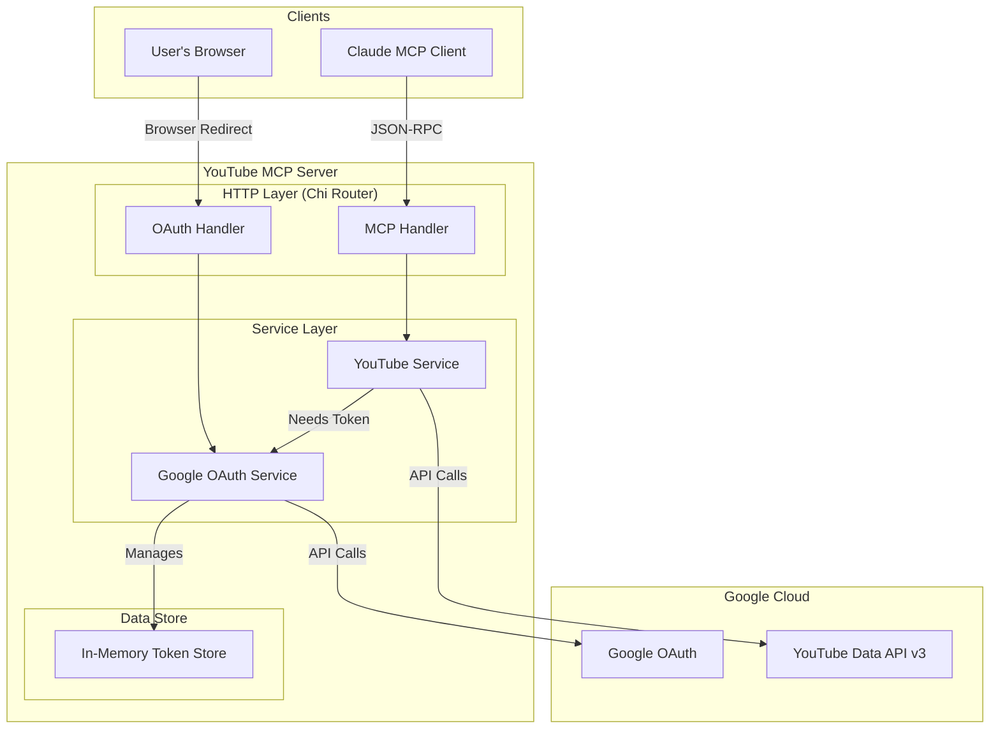

# YouTube MCP Server - Product Requirements & Design Document

## Document Overview

**Version**: 2.0
**Date**: August 2025
**Status**: Design Pivot
**Team**: AI Infrastructure

This document serves as the comprehensive Product Requirements Document (PRD) and technical design specification for the YouTube MCP (Model Context Protocol) Server project.

---

## Table of Contents

1. [Executive Summary](#executive-summary)
2. [Problem Statement & Pivot](#problem-statement--pivot)
3. [Product Requirements](#product-requirements)
4. [Technical Architecture](#technical-architecture)
5. [Implementation Details](#implementation-details)
6. [Security & Compliance](#security--compliance)
7. [User Experience](#user-experience)
8. [Success Metrics](#success-metrics)
9. [Future Roadmap](#future-roadmap)

---

## Executive Summary

### Project Vision
Create a secure, lightweight, and reliable MCP server that provides Claude.ai and other AI assistants with a powerful suite of tools to search, analyze, and manage YouTube content using the official YouTube Data API v3.

### Key Objectives
- **Versatility**: Provide a range of tools covering public data analysis and owner-specific actions.
- **Reliability**: Use official YouTube Data API v3 for all interactions.
- **Ease of Use**: Package the server as a simple, self-contained application with minimal setup.
- **User Experience**: Enable seamless, conversational interaction with YouTube through an AI assistant.
- **Security**: Ensure user data is handled securely through the standard OAuth 2.0 flow.

---

## Problem Statement & Pivot

### Initial Challenge
The project began with the goal of creating an MCP server for YouTube transcript access. The primary challenge was to do so using official, reliable APIs.

### Technical Context Discovery & Project Pivot
During development and testing, we made a critical discovery:

**The YouTube Data API v3 does not permit the downloading of caption tracks for videos that are not owned by the authenticated user.**

This is a fundamental platform policy to protect content creators. This finding made the initial goal of a general-purpose transcript tool for any public video unfeasible through official API channels.

As a result, the project has been pivoted. Instead of focusing on a single, non-viable feature, the new goal is to leverage the many other powerful capabilities of the YouTube Data API v3 to create a versatile toolkit for LLMs. The architecture has also been simplified to a database-less, in-memory model suitable for a single-user desktop application, prioritizing ease of deployment.

---

## Product Requirements

### Functional Requirements

#### Category 1: Public Data Tools (No Ownership Required)
- **FR-001**: Search for YouTube videos by a string query, with optional filters.
- **FR-002**: Retrieve detailed metadata for a specific video ID (title, description, stats, etc.).
- **FR-003**: Retrieve the top-level comment threads for a specific video.

#### Category 2: Owner-Only Tools (Requires User to be Channel Owner)
- **FR-004**: Reply to a comment on a video owned by the authenticated user.
- **FR-005**: Create a new playlist on the user's channel.
- **FR-006**: Add a video to one of the user's playlists.

#### Core Technical Requirements
- **FR-007**: Authenticate the user via Google OAuth 2.0 to get permissions.
- **FR-008**: Implement the MCP protocol for AI assistant integration.
- **FR-009**: Provide clear error messages and guidance to the user.

---

## Technical Architecture

### System Architecture
The architecture has been simplified to a lightweight, in-memory model suitable for a single-user desktop application.

### Key Implementation Decisions

#### 1. In-Memory Token Storage
**Decision**: Store the user's OAuth token in memory instead of a database.
**Rationale**:
- Simplifies deployment immensely for the target single-user, desktop use case.
- Removes the need for the user to set up and manage a database.
- Enhances security by not writing sensitive refresh tokens to disk.
- The trade-off (loss of authentication on restart) is acceptable for this use case.

#### 2. Focus on a Suite of Tools
**Decision**: Pivot from a single-feature (transcripts) to a multi-feature toolkit.
**Rationale**:
- The original goal was found to be technically infeasible via official APIs.
- The YouTube Data API offers a wide range of other valuable functions perfect for LLM integration.

---

## Implementation Details

### Available Tools

The server will expose the following tools to the MCP client:

#### Public Tools
1.  **`search_videos`**
    - **Description**: Searches for YouTube videos.
    - **Arguments**:
        - `query` (string, required): The search term.
        - `channel_id` (string, optional): Restricts search to a specific channel.
        - `limit` (int, optional): Max number of results (default: 10).
    - **Returns**: A list of video objects with IDs, titles, and channel info.

2.  **`get_video_metadata`**
    - **Description**: Gets detailed information for a specific video.
    - **Arguments**:
        - `video_id` (string, required): The ID of the video.
    - **Returns**: An object with the video's title, description, tags, view count, like count, duration, etc.

3.  **`get_video_comments`**
    - **Description**: Fetches top-level comment threads for a video.
    - **Arguments**:
        - `video_id` (string, required): The ID of the video.
        - `sort_by` (string, optional): "top" or "recent" (default: "top").
        - `limit` (int, optional): Max number of results (default: 20).
    - **Returns**: A list of comment objects with author, text, and like count.

#### Owner-Only Tools
4.  **`reply_to_comment`**
    - **Description**: Posts a reply to a comment. Requires authentication as the channel owner.
    - **Arguments**:
        - `comment_id` (string, required): The ID of the comment to reply to.
        - `text` (string, required): The content of the reply.
    - **Returns**: The newly created reply object.

5.  **`add_video_to_playlist`**
    - **Description**: Adds a video to one of the user's playlists. Requires authentication as the channel owner.
    - **Arguments**:
        - `playlist_id` (string, required): The ID of the playlist.
        - `video_id` (string, required): The ID of the video to add.
    - **Returns**: A success message.

---

## User Experience

### User Journey

1.  **First-Time Setup**: The user runs the server and is prompted to authorize it by visiting a URL. They log in with Google and grant permissions for their YouTube account.
2.  **Tool Usage**: The user can now ask their AI assistant to perform actions like "Find recent videos about Gemini" or "Summarize the comments on this video."
3.  **Owner Actions**: If the user is the owner of a channel, they can perform actions like "Reply to the top comment on my latest video saying 'Thanks!'".
4.  **Server Restart**: If the server is restarted, the user must re-authorize it by visiting the URL again.

---

## Future Roadmap

### Short Term (Next 3 Months)
- **Implement Core Tools**: Build out the robust implementation for `search_videos`, `get_video_metadata`, and `get_video_comments`.
- **Solidify Owner-Only Actions**: Implement and test `reply_to_comment` and `add_video_to_playlist`.
- **User Guide**: Create a clear guide for end-users explaining how to get their own Google OAuth credentials.

### Medium Term (3-6 Months)
- **Advanced Analysis**: Create composite tools, e.g., a tool to "find a video and summarize its comments" in one call.
- **Sentiment Analysis**: Integrate basic sentiment analysis into the `get_video_comments` tool.
- **Playlist Management**: Add tools for creating playlists and reordering items.

### Long Term (6+ Months)
- **AI-Powered Community Management**: Develop more advanced agent-like capabilities for comment moderation and interaction.
- **Video Uploads/Updates**: Explore tools for updating video metadata or uploading new videos through the API. 