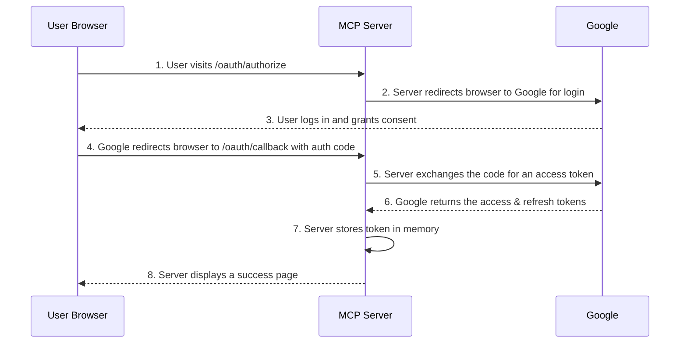

# OAuth Integration for YouTube MCP Server

## Overview

This document explains how the simplified OAuth 2.0 integration works in our YouTube MCP Server. The goal is to allow a user to grant the server permission to access and manage their YouTube account data via the official YouTube Data API v3.

For our single-user, desktop application model, we use a straightforward OAuth flow that prioritizes ease of use and setup.

## The Authentication Flow

Since the server is a self-contained application run by a single user, we no longer need the complex, multi-step discovery and dynamic registration process designed for multi-tenant web services. The flow is much simpler.

**Step 1: User Initiates Authorization**

When a user wants to use a tool that requires owner-level permissions (like replying to a comment), the AI assistant will instruct them to authorize the server. The user opens a specific URL in their browser:

```
http://localhost:8080/oauth/authorize
```

**Step 2: Redirect to Google**

The MCP server immediately redirects the user to Google's standard OAuth 2.0 consent screen. The URL includes the specific permissions (scopes) the server needs, such as `https://www.googleapis.com/auth/youtube`.

**Step 3: User Grants Consent**

The user logs into their Google account (if they aren't already) and agrees to grant the requested permissions to the application.

**Step 4: Google Redirects Back to Server**

Google redirects the user's browser back to the server's callback endpoint (`/oauth/callback`) with a temporary authorization code.

**Step 5: Server Exchanges Code for Token**

The server takes the temporary code and exchanges it directly with Google for an `access_token` and a `refresh_token`. This token is then stored **in memory** for the duration of the server's session.

**Step 6: Ready to Use**

The server is now authenticated and can make API calls to YouTube on the user's behalf. If the server is restarted, this process must be repeated.

## Simplified Architecture



## Implementation Requirements

### Key Responsibilities

1.  **Redirect to Google**: The `/oauth/authorize` endpoint must correctly form and redirect to the Google OAuth URL.
2.  **Handle the Callback**: The `/oauth/callback` endpoint must handle the response from Google, exchange the code for a token, and store it in memory.
3.  **Attach Token to API Calls**: The YouTube service must retrieve the in-memory token and attach it to all outgoing API requests that require authorization.
4.  **Proactive Refresh**: A background process should use the `refresh_token` to keep the `access_token` fresh to ensure a smooth user experience during a long session.

### Environment Variables Required

```bash
# Google OAuth (for YouTube API access)
GOOGLE_CLIENT_ID="your-google-oauth-client-id"
GOOGLE_CLIENT_SECRET="your-google-oauth-client-secret"
```

This simplified approach provides the necessary security and permissions for the server to function, while aligning with the goal of creating a lightweight, easy-to-deploy application for personal use. 